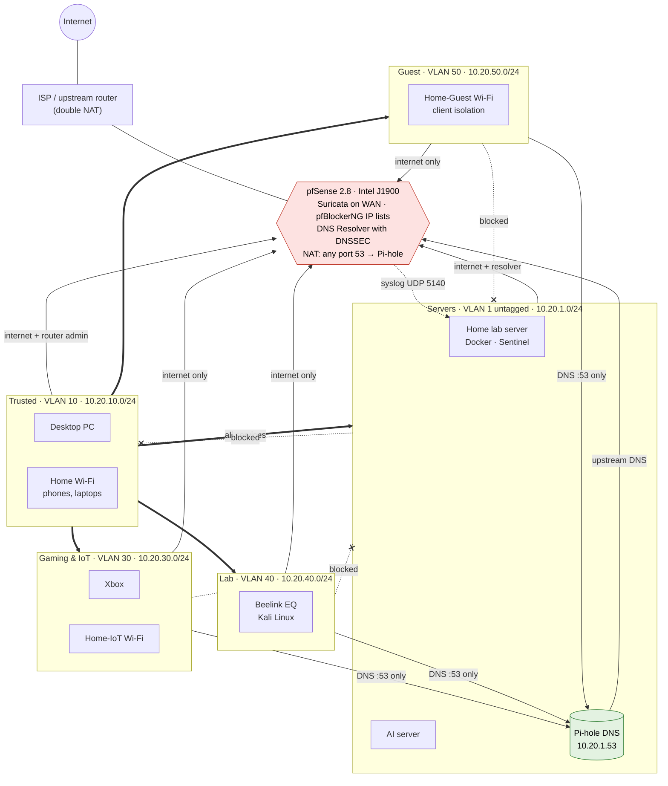

# Desk Pi Rack

Documentation and inventory for the desk-mounted home lab / mini server rack.

## Rack

- **Rack:** GEEEKPi DeskPi RackMate T1 8U, 10-inch Mini Server Rack
- **Rack size:** 8U
- **Rack width:** 10-inch
- **Rack depth:** 7.87 inches
- **PDU:** ElecVoztile 125 V / 15 A / 1,875 W
- **Cooling:** Noctua NF-F12 5V intake + AC Infinity MULTIFAN S3 exhaust

## Current Inventory

| Category | Device | Specifications | Role |
|---|---|---|---|
| Rack | GEEEKPi DeskPi RackMate T1 | 8U, 10-inch, 7.87-inch depth | Physical rack |
| Power | ElecVoztile PDU | 125 V, 15 A, 1,875 W | Power distribution |
| Cooling | Noctua NF-F12 5V | 120 mm, 5 V, 1,500 RPM, USB-A adapter | Intake fan |
| Cooling | AC Infinity MULTIFAN S3 | 120 mm, USB, UL-certified | Exhaust fan |
| Network | GL.iNet GL-BE9300 Flint 3 | Wi-Fi 7 | Access point |
| Firewall | Intel J1900 mini PC | 4 × Intel i210 Ethernet, 4 GB RAM, 64 GB SSD | pfSense router/firewall |
| Switch | TP-Link TL-SG108E | 8 × Gigabit Ethernet, managed | Network switching |
| Home Lab Server | MINISFORUM X1 Lite-255 | AMD Ryzen 7 255, 8C/16T, up to 4.9 GHz, 32 GB DDR5, 1 TB SSD, Ubuntu Server | Uptime Kuma, Portainer, Docker containers, Stash Notes App |
| AI Server | Desktop PC | Intel Core i5-13600K, RTX 4070 12 GB, 32 GB DDR5, 2 TB SSD | 24/7 AI server |
| Computer | Beelink EQ Mini PC | Quad Core N150, 12 GB LPDDR5, 500 GB SSD + 2 TB Seagate SSD | Kali Linux workstation |
| Computer | Raspberry Pi 5 | 8 GB RAM, 128 GB SSD | Pi-hole ad blocker |
| Peripheral | KCEVE 8-Port HDMI KVM Switch | 8 computers, 1 monitor, HDMI, 4K @ 60 Hz, USB 3.0, shared keyboard/mouse, hotkey switching | Computer/console access |

## MINISFORUM Home Lab Server

The MINISFORUM X1 Lite-255 runs **Ubuntu Server** and serves as the main Docker host for the rack's containerized home-lab services.

- **Monitoring:** Uptime Kuma
- **Container management:** Portainer
- **Container runtime:** Docker
- **Uptime:** Intended to run continuously / 24×7

The Docker container inventory can be documented here as additional services are added.

## 24/7 AI Server

A separate desktop PC is used as a dedicated **24/7 AI server**.

- **CPU:** Intel Core i5-13600K
- **GPU:** NVIDIA GeForce RTX 4070
- **VRAM:** 12 GB
- **RAM:** 32 GB DDR5
- **Storage:** 2 TB SSD
- **Role:** AI server
- **Uptime:** Intended to run continuously / 24×7

## Documentation Status

This inventory is a work in progress. Specifications that have not yet been provided are intentionally marked **TBD** rather than guessed.

## Network & Security

The network is segmented into VLAN zones behind pfSense, with DNS filtering, IP reputation blocking and intrusion detection. All addresses in these documents are **example addresses**.

### Physical layout

How the firewall, switch and access point connect, and which zones each carries:

```text
                          Internet
                             |
                    ISP / upstream router
                             |  (double NAT, WAN on a private network)
                   +-------------------+
                   |   pfSense 2.8.x   |  J1900, 4 × Intel i210
                   |  WAN igb1         |  Suricata (WAN), pfBlockerNG (IP lists)
                   |  LAN igb0 + VLANs |  DNS Resolver (DNSSEC)
                   +---------+---------+
                             | trunk: untagged 1, tagged 10/30/40/50
                   +---------+---------+
                   |  TP-Link TL-SG108E |  802.1Q VLANs
                   +---------+---------+
      +-------------+--------+--------+-------------+-------------+
      |             |                 |             |             |
  Servers (1)   Trusted (10)    Gaming/IoT (30)  Lab (40)    GL.iNet AP
  Home lab srv  Desktop PC      Xbox             Beelink      untagged 10 →  "Home"
  AI server                                      (Kali)       tagged 30    →  "Home-IoT"
  Pi-hole                                                     tagged 50    →  "Home-Guest"
```

### Zones and firewall flows

Arrows show who may **start** a connection (replies always return). Solid arrows are allowed, thick arrows are Trusted's full access, dotted arrows ending in ✕ are blocked by pfSense, and the dotted arrow to the home lab server is pfSense's log feed to Sentinel. Details are in [network/firewall.md](network/firewall.md).



### Network documents

| Document | Contents |
|---|---|
| [Network topology](network/topology.md) | Overview diagram, zones at a glance, and a diagram of the zones and firewall flows |
| [Zones (VLANs)](network/zones.md) | Subnets, DHCP, device placement, what each zone can reach |
| [pfSense firewall](network/firewall.md) | Router hardening, per-zone rules, forced DNS, pfBlockerNG, Suricata, logging |
| [DNS](network/dns.md) | Pi-hole → pfSense resolver with DNSSEC; blocking DNS bypass |
| [Switch](network/switch.md) | TL-SG108E 802.1Q VLANs and port map |
| [Wi-Fi access point](network/wifi-ap.md) | GL.iNet Flint 3 multi-SSID VLAN setup in AP mode |
| [Server hardening](network/server-hardening.md) | ufw, fail2ban, Docker/Portainer exposure |
| [Maintenance](network/maintenance.md) | Routine tasks, isolation tests, backups, lessons learned |
