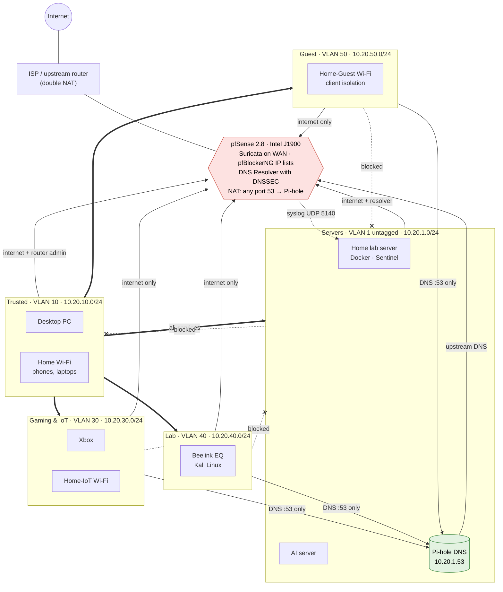

# Network Topology

> **Addressing note:** every IP address and subnet in this repository is an **example** in the `10.20.0.0/16` range. It shows the design, not the real network. Wi-Fi network names are generic too.

## Overview

pfSense on the Intel J1900 is the router and firewall for the whole desk lab. The network is split into **zones (VLANs)**, and every packet between zones goes through pfSense, which allows only the paths listed in [zones.md](zones.md). The TP-Link switch carries the zones to each device, and the GL.iNet Flint 3 (in **access point mode**) gives each Wi-Fi zone its own network name.

```text
                          Internet
                             |
                    ISP / upstream router
                             |  (double NAT, WAN on a private network)
                   +-------------------+
                   |   pfSense 2.8.x   |  J1900, 4 × Intel i210
                   |  WAN igb1         |  Suricata (WAN), pfBlockerNG (IP lists)
                   |  LAN igb0 + VLANs |  DNS Resolver (DNSSEC)
                   +---------+---------+
                             | trunk: untagged 1, tagged 10/30/40/50
                   +---------+---------+
                   |  TP-Link TL-SG108E |  802.1Q VLANs
                   +---------+---------+
      +-------------+--------+--------+-------------+-------------+
      |             |                 |             |             |
  Servers (1)   Trusted (10)    Gaming/IoT (30)  Lab (40)    GL.iNet AP
  Home lab srv  Desktop PC      Xbox             Beelink      untagged 10 →  "Home"
  AI server                                      (Kali)       tagged 30    →  "Home-IoT"
  Pi-hole                                                     tagged 50    →  "Home-Guest"
```

## Zones at a glance

| Zone | VLAN | Example subnet | Devices | Can reach |
|---|---|---|---|---|
| Servers (main LAN) | 1 (untagged) | 10.20.1.0/24 | Home lab server, AI server, Pi-hole, switch management | Internet, pfSense services. Cannot start connections into other zones |
| Trusted | 10 | 10.20.10.0/24 | Desktop PC, phone and laptops on "Home" Wi-Fi, AP management | Everything |
| Gaming & IoT | 30 | 10.20.30.0/24 | Xbox, "Home-IoT" Wi-Fi | Internet and Pi-hole DNS only |
| Lab | 40 | 10.20.40.0/24 | Beelink EQ (Kali Linux) | Internet and Pi-hole DNS only |
| Guest | 50 | 10.20.50.0/24 | "Home-Guest" Wi-Fi (client isolation on) | Internet and Pi-hole DNS only |

Replies to allowed connections always come back through the firewall's state table. That's why Trusted devices can use services in the Servers zone even though servers can't start connections into Trusted.

## Zones and firewall flows

Arrows show who may **start** a connection (replies always return). Solid arrows are allowed, thick arrows are Trusted's full access, dotted arrows ending in ✕ are blocked by pfSense, and the dotted arrow to the home lab server is pfSense's log feed to Sentinel. The rules behind each arrow are in [firewall.md](firewall.md).



## Related documents

| Document | Contents |
|---|---|
| [zones.md](zones.md) | Subnets, DHCP, and what each zone may reach |
| [firewall.md](firewall.md) | pfSense hardening, rules, NAT, pfBlockerNG, Suricata |
| [dns.md](dns.md) | Pi-hole ↔ pfSense resolver, forced DNS, blocking encrypted DNS |
| [switch.md](switch.md) | TL-SG108E 802.1Q VLANs and port map |
| [wifi-ap.md](wifi-ap.md) | GL.iNet Flint 3 as a multi-SSID VLAN access point |
| [server-hardening.md](server-hardening.md) | ufw, fail2ban, Docker and Portainer exposure |
| [maintenance.md](maintenance.md) | Routine tasks, backups, recovery and lessons learned |

## Monitoring

**Sentinel**, a self-hosted SOC dashboard running on the home lab server, receives pfSense's firewall and DHCP logs by syslog. It shows router-level blocks, devices in every zone with zone labels, and alerts through Discord.
